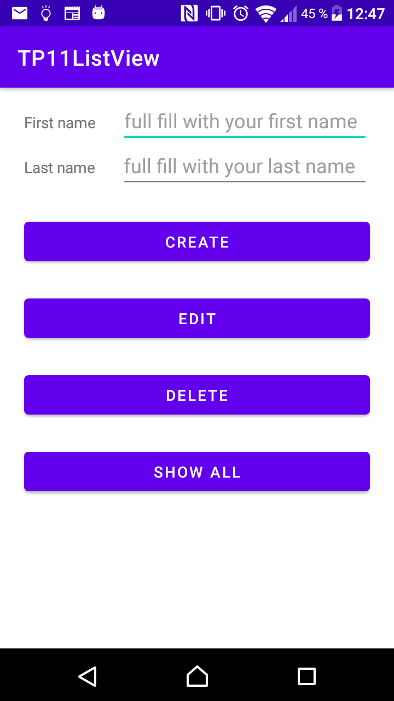
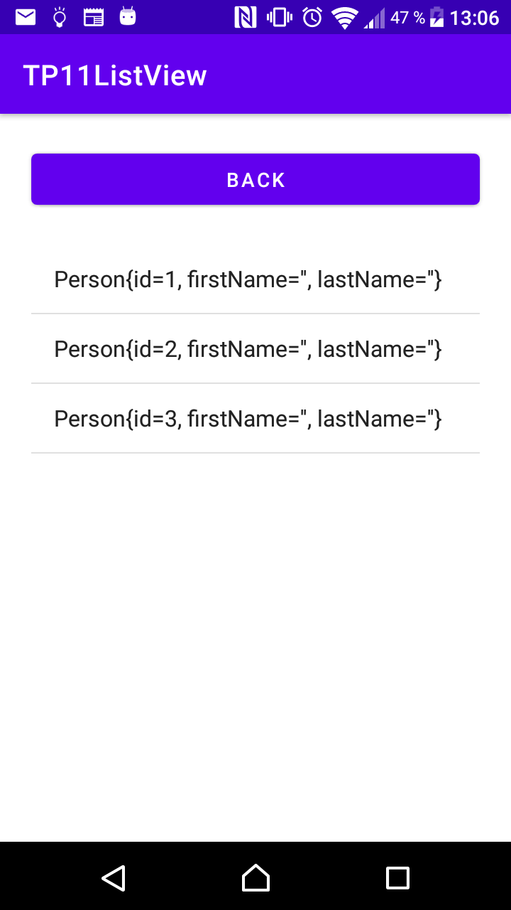
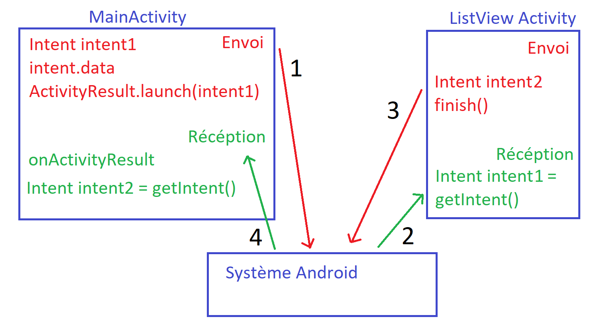

= TP 11 Android ListView Kotlin

=== exo sur la branche master
en partant de la version java, +
passage vers une implémentation kotlin +
tel que le screen suivant: +
+
MainActivity +

+
+
SecondActivity +

+
+

